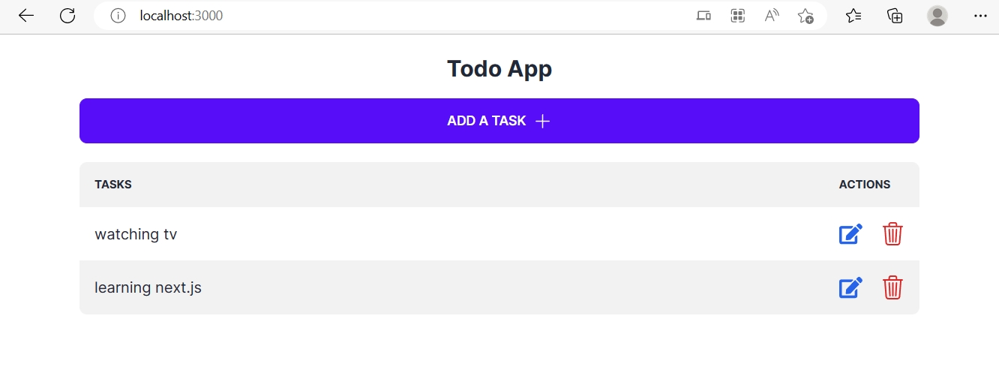
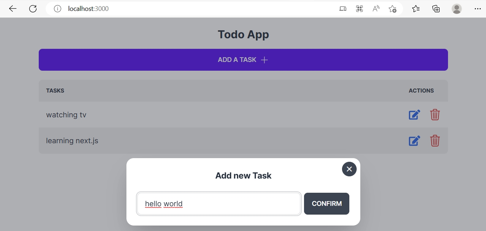
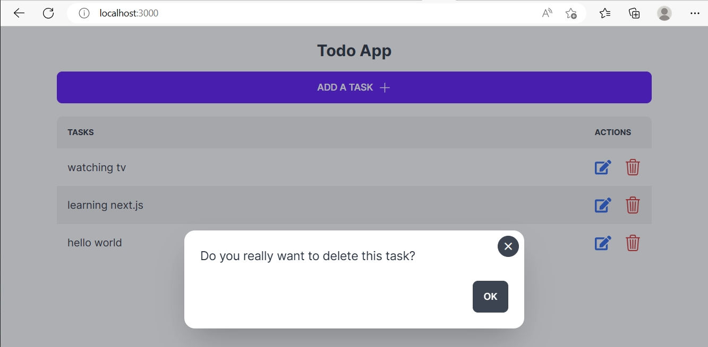

# TODO APP

This project aims to get into the next.js framework. It is a learning by doing project.

## See the result
First, run the development server:

```bash
npm run dev
# or
yarn dev
# or
pnpm dev
```

Open [http://localhost:3000](http://localhost:3000) with your browser to see the result.

## Some images from the project
### View all tasks

### Adding a task

### Deleting a task
